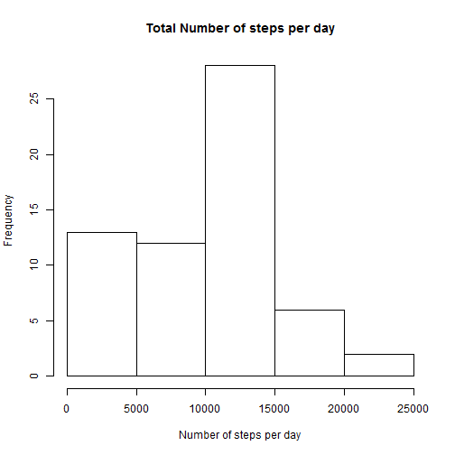
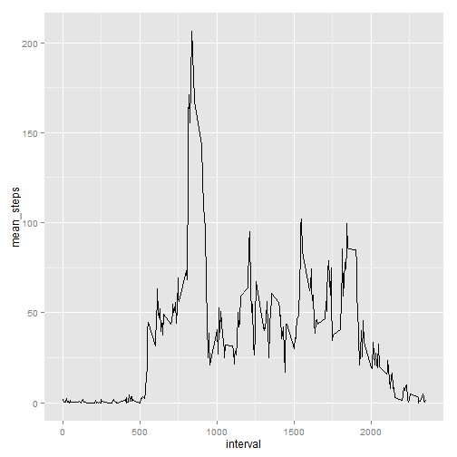
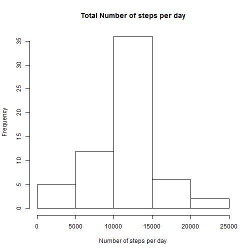
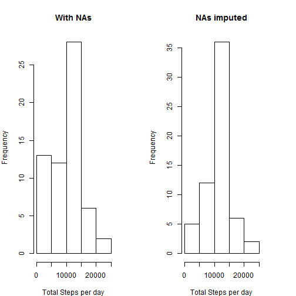
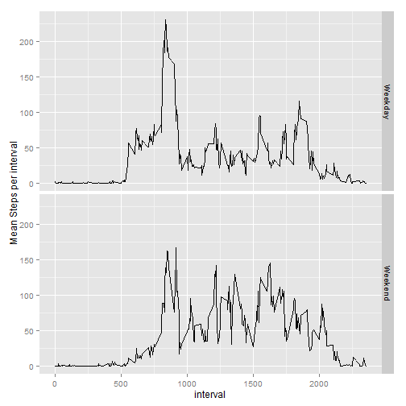

**Dear Peer,**

**I will paste the assignment questions and will do the corresponding working underneath it. Any explaination, if required, will be present before the code chunk. Every piece of text that is added by me will be in bold. Just like this one**

## Loading and preprocessing the data

- Load the data (i.e. read.csv())


```r
require("dplyr")
require("ggplot2")
require("Hmisc")
require("lubridate")
options(scipen = 999)
activity_data <- read.csv("activity.csv", header = TRUE)
```

- Process/transform the data (if necessary) into a format suitable for your analysis

## What is mean total number of steps taken per day?

For this part of the assignment, you can ignore the missing values in the dataset.

- Calculate the total number of steps taken per day


```r
by_date <- activity_data %>% group_by(date) %>% summarise(total_steps = sum(steps, na.rm = TRUE))
by_date
```

```
## Source: local data frame [61 x 2]
## 
##          date total_steps
##        (fctr)       (int)
## 1  2012-10-01           0
## 2  2012-10-02         126
## 3  2012-10-03       11352
## 4  2012-10-04       12116
## 5  2012-10-05       13294
## 6  2012-10-06       15420
## 7  2012-10-07       11015
## 8  2012-10-08           0
## 9  2012-10-09       12811
## 10 2012-10-10        9900
## ..        ...         ...
```


- If you do not understand the difference between a histogram and a barplot, research the difference between them. Make a histogram of the total number of steps taken each day


```r
hist(by_date$total_steps, main = "Total Number of steps per day", xlab = "Number of steps per day")
```

 


- Calculate and report the mean and median of the total number of steps taken per day

**Mean = 9354.2295082 steps**  
**Median = 10395 steps**

## What is the average daily activity pattern?

- Make a time series plot (i.e. type = "l") of the 5-minute interval (x-axis) and the average number of steps taken, averaged across all days (y-axis)

```r
by_interval <-activity_data %>% group_by(interval) %>% summarise(mean_steps = mean(steps, na.rm = TRUE))
qplot(data = by_interval,x = interval, y=mean_steps, geom = 'line')
```

 

- Which 5-minute interval, on average across all th-e days in the dataset, contains the maximum number of steps?

**Maximum number of steps is in the 835 interval**

## Imputing missing values

Note that there are a number of days/intervals where there are missing values (coded as NA). The presence of missing days may introduce bias into some calculations or summaries of the data.

- Calculate and report the total number of missing values in the dataset (i.e. the total number of rows with NAs)


```r
total_NA <- sum(is.na(activity_data$steps))
```
**Total number of NAs are 2304**

- Devise a strategy for filling in all of the missing values in the dataset. The strategy does not need to be sophisticated. For example, you could use the mean/median for that day, or the mean for that 5-minute interval, etc.

**The best strategy would be to impute the values of the mean of the 5 minute interval within with the NA value exists.  To do that I will use the `by_interval` data.frame and merge it with the `activity_data` and then use `replace` to  impute the values ** 

- Create a new dataset that is equal to the original dataset but with the missing data filled in.

```r
activity_data2 <- merge(activity_data, by_interval) %>% arrange(date,interval)
activity_data2$steps <- replace(activity_data2$steps, is.na(activity_data2$steps), activity_data2$mean_steps)
```

```
## Warning in replace(activity_data2$steps, is.na(activity_data2$steps),
## activity_data2$mean_steps): number of items to replace is not a multiple of
## replacement length
```

```r
activity_data2$mean_steps = NULL
by_date2 <- activity_data2 %>% group_by(date) %>% summarise(total_steps = sum(steps))
```


- Make a histogram of the total number of steps taken each day and Calculate and report the mean and median total number of steps taken per day. Do these values differ from the estimates from the first part of the assignment? What is the impact of imputing missing data on the estimates of the total daily number of steps?


```r
hist(by_date2$total_steps, main = "Total Number of steps per day", xlab = "Number of steps per day")
```

 


```r
par(mfrow = c(1,2), mar = c(4,4,4,4))

hist(by_date$total_steps, main = "With NAs", xlab = "Total Steps per day")
hist(by_date2$total_steps, main = "NAs imputed",xlab = "Total Steps per day")
```

 

**Mean = 10766.1886792 steps**  
**Median = 10766.1886792 steps**

**The distribution tends to shift towards the mean after imputing NAs**


## Are there differences in activity patterns between weekdays and weekends?

For this part the weekdays() function may be of some help here. Use the dataset with the filled-in missing values for this part.

- Create a new factor variable in the dataset with two levels - "weekday" and "weekend" indicating whether a given date is a weekday or weekend day.

```r
activity_data2$date <- ymd(activity_data2$date)
activity_data2$days <- factor(rep("Weekday", length = nrow(activity_data2)), levels = c("Weekday","Weekend"))
activity_data2$days <- replace(activity_data2$days, wday(activity_data2$date) == 1 | wday(activity_data2$date)==7, as.factor("Weekend"))

## Table below shows the count of weekends and weekdays
table(activity_data2$days)
```

```
## 
## Weekday Weekend 
##   12960    4608
```
- Make a panel plot containing a time series plot (i.e. type = "l") of the 5-minute interval (x-axis) and the average number of steps taken, averaged across all weekday days or weekend days (y-axis). See the README file in the GitHub repository to see an example of what this plot should look like using simulated data.


```r
by_interval_and_day <- activity_data2 %>% group_by(interval,days) %>% summarise(mean_steps = mean(steps))
qplot(data = by_interval_and_day, x = interval,y = mean_steps, geom = "line", facets = days~.,ylab = "Mean Steps per interval")
```

 
